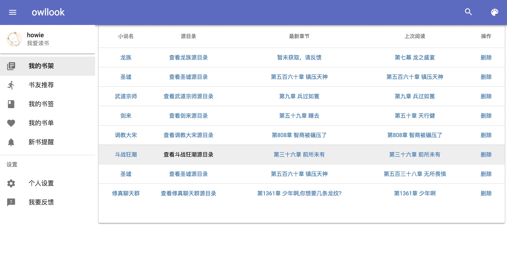
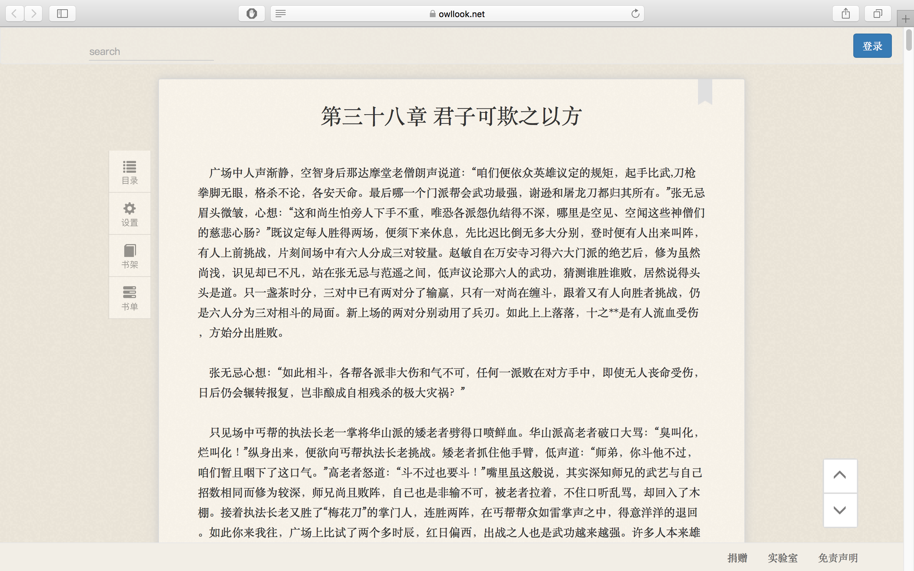

### 1.说明

网络小说搜索引擎——owllook 演示网址：[https://www.owllook.net/](https://www.owllook.net/)

> `owllook`是一个基于其他搜索引擎的垂直小说搜索引擎
>
> 目标是满足小说爱好者的**搜书、阅读、收藏、追更、推荐等功能**
>
> 若将本项目部署并发行，请声明来源，**本项目纯属共享学习之用，不得用于商业！**

#### 1.1.项目介绍

`owllook`使用了mongodb储存了用户使用过程中的产生的基本信息，诸如注册信息、搜索小说信息、收藏小说数据等，对于某些必要的缓存，则利用redis进行缓存处理，如小说缓存、session缓存，注意，对于限制数据：都将在24小时删除

对于不同网站的小说，页面规则都不尽相同，我希望能够在代码解析后再统一展示出来，这样方便且美观，而不是仅仅跳转到对应网站就完事，清新简洁的阅读体验才是最重要的

目前采用的是直接在搜索引擎上进行结果检索，我尽量写少量的规则来完成解析，具体见[规则定义](./docs/规则定义.md)，遇到自己喜欢的小说网站，你也可以自己添加解析，`owllook`目前解析了超过 **200+** 网站，追更网站解析了**50+**

有一些地方需要用到爬虫，比如说排行榜，一些书籍信息等，我不想动用重量级爬虫框架来写，于是我在owllook里面编写了一个很轻量的爬虫模块来做这件事，见 **[talonspider](https://github.com/howie6879/talonspider)**

BTW，sanic写界面确实不是很方便，至于为什么写这个，一是想利用`sanic`尽量做成异步服务，二是想就此练习下推荐系统，顺便作为毕业设计

若觉得还可以，就给个 **star** 吧，详细介绍 [owllook -- 一个简洁的网络小说搜索引擎](http://blog.howie6879.cn/2017/03/10/22/)

**如果您希望在终端下看小说，可以试试这个项目[NIYT](https://github.com/howie6879/NIYT)**

**关于安装：**

请先装好mongo以及redis，然后python环境请确认在python3.5+，不会安装mongo看[这里](https://www.digitalocean.com/community/tutorials/how-to-install-mongodb-on-centos-7)

mongo以及redis装好后，进入项目目录，依照步骤执行：

```shell
# 方案一
pip install -r requirements.txt
# 运行：
python server.py
# 或者
gunicorn --bind 127.0.0.1:8001 --worker-class sanic.worker.GunicornWorker server:app

# 方案二
docker build -t owllook:0.1 .
# 在dev_owllook.env里面填上数据库配置 数据库ip需要注意 不得填localhost
docker run --env-file ./dev_owllook.env -d -p 8001:8001 owllook:0.1
```

#### 1.2.项目进度

**v0.1.0：**

- 小说的基本搜索解析功能
- 搜索记录
- 缓存
- 书架
- 书签
- 登录
- 初步兼容手机（后续跟进）

**TODO:**

- [x] 注册（开放注册）
- [x] 上次阅读
- [x] 最新章节
- [x] 书友推荐（很基础的推荐）
- [x] 目录获取
- [x] 翻页
- [x] 搜索排行
- [x] 部分页面重写
- [ ] 排行榜（进行中）
- [ ] 阅读书单
- [ ] 推荐

**交流群：591460519，欢迎提issue**

### 2.效果图

下面是一些截图展示，具体效果图请看[这里](http://oe7yjec8x.bkt.clouddn.com/howie/2017-03-08-owllook.gif)：

-----------------------

2017-07-29更新

书架：



目录解析页：


阅读：



### 3.License

`owllook` is offered under the Apache 2 license.

### 4.感谢

**owllook使用了以下第三方包:**

- sanic：基于Python 3.5+的异步web服务器

- sanic_session：sanic的持续会话插件

- uvloop：sanic默认使用uvloop，替代asyncio本身的loop

- motor：异步的mongodb驱动

- ​Jinja2：基于python的模板引擎

- aiohttp：异步请求

- aiocache：异步缓存，本项目改用了其中的decorator部分，缓存数据库使用redis

- caddy：基于go的web服务器

  …...更多见requirements.txt，感谢开发者。

**web框架：**

[bootstrap](https://github.com/twbs/bootstrap)：Sleek, intuitive, and powerful front-end framework for faster and easier web development. 

[mdui](https://github.com/zdhxiong/mdui )：MDUI 是一个基于 Material Design 的前端框架

**感谢以下捐赠者 ^_^ :**
- 12hStudy: 5 元
- 佚名：5元
- 佚名：50元
- 路人甲、：100元
- 盛阿德：20元
- shine：50元
- 江黑龙：10元
- Future：100元
- Mongol Hun ：20元
- 佚名：15元


